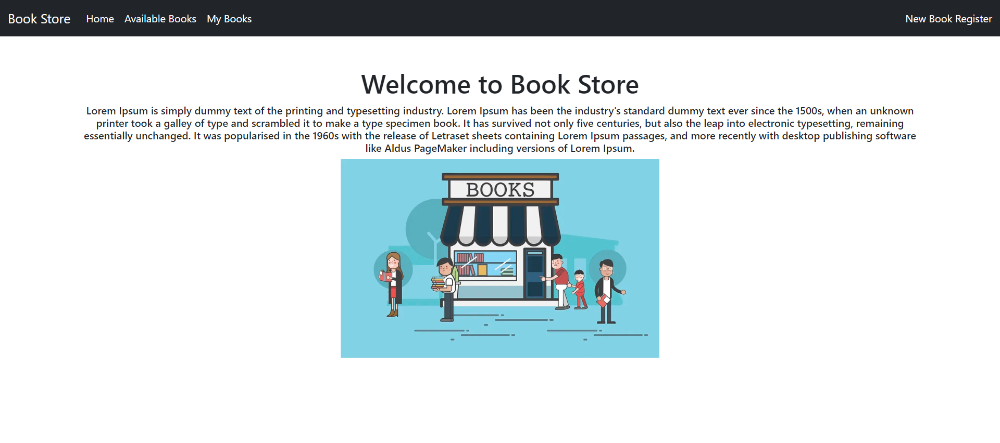
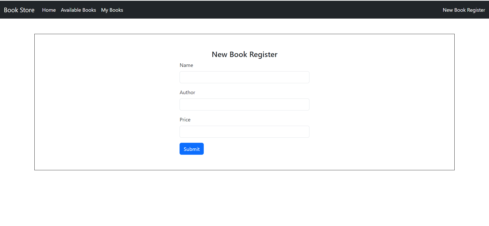
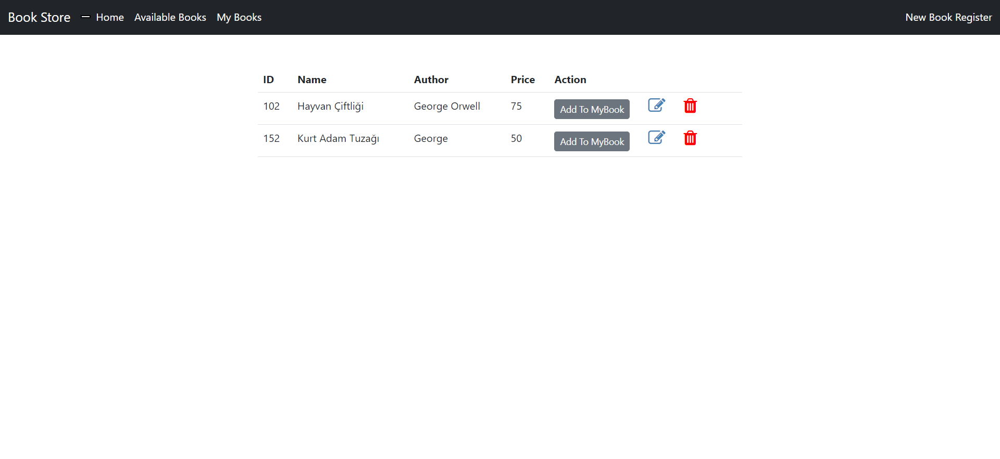
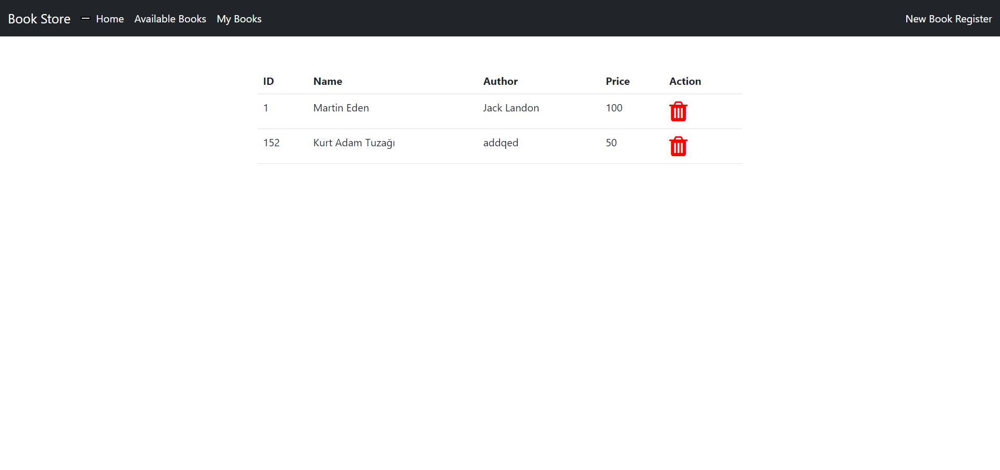

**Book Store Managment**

Spring Boot / Thymeleaf/ Jpa / Mysql

>I create simple spring boot app using MySql, Thymeleaf,JPA.

### Home Page

### New Book Register 
We are registering a new book
 

### Available Books
View a list of available books in the store .Options to update, delete, and add books to my library.

### My Books
List of books in my library and option to delete.

